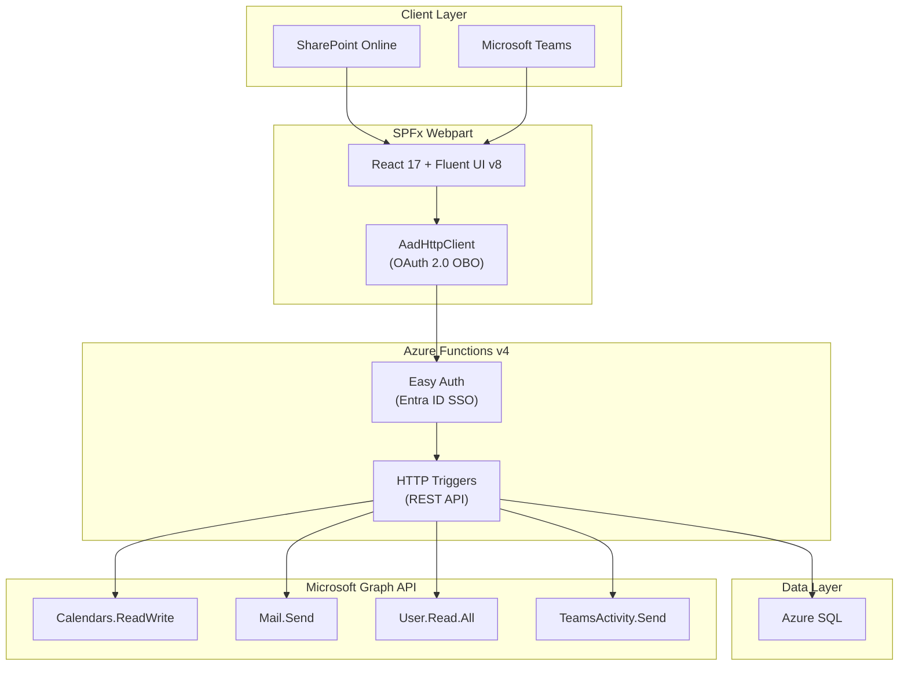

# Phase 10: Documentation - Research

**Researched:** 2026-02-26
**Domain:** Technical documentation (Markdown, GitHub-rendered docs, Mermaid diagrams)
**Confidence:** HIGH

## Summary

Phase 10 is documentation-only -- no code changes. Three deliverables: (1) an Entra ID app registration guide (`docs/app-registration.md`), (2) a deployment guide (`docs/deployment.md`), and (3) a portfolio README (`README.md` at repo root). The existing codebase provides all the source material -- Graph API permission scopes, SPFx package configuration, Teams manifest structure, environment variable templates, and architecture patterns are fully documented in source files. Phase 9 verification findings provide tested-and-confirmed values that the guides must reference accurately.

The primary challenge is accuracy: the docs must reflect the actual configuration values (client IDs, permission scope GUIDs, menu paths in Azure Portal/SharePoint Admin Center) rather than generic instructions. The secondary challenge is presentation: the README must serve as a portfolio showcase for hiring managers while the guides must serve as operational runbooks for admins and developers.

**Primary recommendation:** Extract all configuration values, permission scopes, and deployment steps from the actual codebase and Phase 9 verification records. Write three separate Markdown files using GitHub-native features (callout blocks, Mermaid diagrams, shields.io badges). No external tooling needed -- plain Markdown authored with a text editor.

<user_constraints>
## User Constraints (from CONTEXT.md)

### Locked Decisions
- Three separate files: README.md at repo root, docs/app-registration.md, docs/deployment.md
- Guides live in a docs/ folder at repo root
- README includes a "Documentation" section with links to each guide and a one-line description
- Use GitHub callout blocks (> [!NOTE], > [!WARNING], > [!TIP]) for important information
- Guides target SharePoint Developers, Azure Architects, and Project Managers
- Professional and direct tone -- like Azure/Microsoft official docs. Action-oriented, no fluff
- Assume the reader already has a Microsoft 365 tenant and SharePoint admin access -- list prerequisites at the top but don't explain how to obtain them
- README targets portfolio reviewers (hiring managers, recruiters, technical leads evaluating work)
- App registration guide: step-by-step numbered instructions with exact menu paths and values, but text-only (no screenshots)
- Include the exact API permission scopes, redirect URIs, and configuration values from the actual app -- reader copies them directly
- Deployment guide: happy path steps plus a "Troubleshooting" section at the end for common gotchas
- Architecture section uses a Mermaid diagram showing SPFx -> Graph API -> SharePoint/Teams flow (renders natively on GitHub)
- README leads with problem statement + solution -- shows product thinking
- Include tech stack badges (shields.io style) at the top
- "Key Features" section with 5-8 bulleted highlights
- Include 1-2 screenshots of the app in action

### Claude's Discretion
- Exact README section ordering
- Mermaid diagram layout and detail level
- Which troubleshooting items to include
- Badge styling and exact badge selection
- Screenshot placement and captioning

### Deferred Ideas (OUT OF SCOPE)
None -- discussion stayed within phase scope
</user_constraints>

<phase_requirements>
## Phase Requirements

| ID | Description | Research Support |
|----|-------------|-----------------|
| DOCS-01 | App registration guide covers Entra ID app setup, API permissions, and Graph API configuration | Codebase analysis identified all 4 Graph API application permissions (Calendars.ReadWrite, Mail.Send, User.Read.All, TeamsActivity.Send), the "Expose an API" user_impersonation scope, client secret creation, and Easy Auth configuration. Phase 9 verification checklist confirms exact permission GUIDs and working configuration. |
| DOCS-02 | SharePoint App Catalog deployment guide covers SPFx package upload, site deployment, and Teams tab setup | package-solution.json provides solution ID, version, webApiPermissionRequests. Teams manifest.json provides activity types, webApplicationInfo, and static tab configuration. Phase 9 session notes document the Teams app deployment process including the TeamsSPFxApp.zip approach and known gotchas. |
| DOCS-03 | Developer README documents architecture, setup instructions, tech stack, and project showcase | PROJECT.md provides architecture overview (17,175 LOC, 254 files, 10 phases). Package.json files document exact dependency versions. Case1_SharePoint_Developer_Senior.md provides the portfolio context (senior SharePoint developer case study). |
</phase_requirements>

## Standard Stack

### Core
| Tool | Version | Purpose | Why Standard |
|------|---------|---------|--------------|
| Markdown (GitHub Flavored) | N/A | Documentation format | Renders natively on GitHub, supports tables, code blocks, callouts |
| Mermaid | v11+ (GitHub native) | Architecture diagrams | Renders natively in GitHub Markdown -- no external image hosting needed |
| shields.io | N/A (hosted service) | Tech stack badges | De facto standard for GitHub README badges |

### Supporting
| Tool | Purpose | When to Use |
|------|---------|-------------|
| GitHub Alerts syntax | Callout blocks (NOTE, WARNING, TIP) | Highlighting prerequisites, common mistakes, important configuration notes |

### Alternatives Considered
| Instead of | Could Use | Tradeoff |
|------------|-----------|----------|
| Mermaid | Draw.io PNG exports | Mermaid is text-based and renders natively on GitHub; PNGs need hosting and manual updates |
| shields.io static badges | Custom SVG badges | shields.io is universally recognized and zero-maintenance |
| GitHub callout blocks | Bold text with emoji | Callout blocks have native styling on GitHub with color coding |

## Architecture Patterns

### Recommended Documentation Structure
```
Rentavehicle/
├── README.md                    # Portfolio README (DOCS-03)
├── docs/
│   ├── app-registration.md      # Entra ID setup guide (DOCS-01)
│   └── deployment.md            # SPFx deployment guide (DOCS-02)
├── api/                         # Azure Functions backend
├── spfx/                        # SPFx frontend
└── scripts/                     # Provisioning scripts
```

### Pattern 1: Exact-Value Documentation
**What:** Every configuration value in the guide is extracted from the actual codebase, not generalized
**When to use:** Always -- for app registration and deployment guides
**Why:** Readers should be able to copy values directly. Generic placeholders like `<your-client-id>` are used only for tenant-specific secrets.

Values to extract from codebase:
- Graph API permissions: `Calendars.ReadWrite`, `Mail.Send`, `User.Read.All`, `TeamsActivity.Send` (from `notificationService.ts` header comments and Phase 9 verification checklist)
- SPFx webApiPermissionRequests: resource `RentAVehicle-API`, scope `user_impersonation` (from `package-solution.json`)
- Teams manifest app ID: `faa3486e-fc56-40d2-b420-c5b9d30257b3` (from `spfx/teams/manifest.json`)
- Teams webApplicationInfo.id: must match backend Entra app registration (from Phase 9 session notes)
- Solution ID: `faa3486e-fc56-40d2-b420-c5b9d30257b3` (from `package-solution.json`)
- SPFx package: `solution/renta-vehicle.sppkg` (from `package-solution.json`)
- Azure Functions CORS origins: `https://localhost:4321`, `http://localhost:4321`, tenant SharePoint domain (from `local.settings.template.json`)
- Environment variables: full list from `local.settings.template.json`

### Pattern 2: Mermaid Architecture Diagram
**What:** Flowchart showing the full system data flow
**When to use:** README architecture section

Key components to show:
```
SPFx Webpart (React 17 + Fluent UI v8)
  → AadHttpClient (OAuth 2.0 on-behalf-of)
    → Azure Functions v4 (Node.js 22)
      → Azure SQL (data store)
      → Microsoft Graph API
        → Exchange calendars (resource + personal)
        → Mail.Send (email notifications)
        → Teams Activity Feed (Teams notifications)
        → User.Read.All (location sync, manager lookup)
```

Hosting environments to show:
- SharePoint Online (SPFx webpart in page)
- Microsoft Teams (SPFx webpart as personal tab)

### Pattern 3: Troubleshooting Section (Problem → Cause → Fix)
**What:** Each troubleshooting item follows a consistent three-part pattern
**When to use:** Deployment guide troubleshooting section

### Anti-Patterns to Avoid
- **Screenshot-heavy guides:** User locked decision says text-only. Menu paths in text are more maintainable than screenshots that break when Azure Portal UI changes.
- **Generic placeholder documentation:** Do not write `<your-permission>` when the exact permission name is known. Use exact names with placeholders only for tenant-specific values.
- **Mixing audience levels:** The app registration guide is for admins, the README is for portfolio reviewers. Do not mix tutorial-style content into the admin guide.

## Don't Hand-Roll

| Problem | Don't Build | Use Instead | Why |
|---------|-------------|-------------|-----|
| Tech stack badges | Custom badge images | shields.io static badge URLs | Zero maintenance, consistent styling, widely recognized |
| Architecture diagrams | External diagram tools | Mermaid in Markdown | Renders on GitHub natively, version-controlled with docs, no image hosting |
| Callout/warning boxes | HTML or emoji hacks | GitHub `> [!NOTE]` syntax | Native rendering with color and icon, clean Markdown source |
| Table of contents | Manual anchor links | GitHub auto-generates ToC for README headings | Less maintenance, auto-updates |

**Key insight:** GitHub renders Mermaid, callout blocks, and shields.io badges natively. No external build tools, static site generators, or image hosting needed for this documentation.

## Common Pitfalls

### Pitfall 1: Stale Configuration Values
**What goes wrong:** Documentation references placeholder or outdated client IDs, permission names, or URLs that don't match the actual deployed app
**Why it happens:** Author writes docs from memory instead of extracting values from source files
**How to avoid:** Every configuration value MUST be cross-referenced against the actual source file. Use the codebase as the single source of truth.
**Warning signs:** Any value in the docs that isn't traceable to a specific source file

**Source files for each value:**
| Value | Source File |
|-------|------------|
| Graph API permissions | `api/src/services/notificationService.ts` (header comment, lines 8-11) |
| SPFx solution ID | `spfx/config/package-solution.json` (solution.id) |
| Teams manifest config | `spfx/teams/manifest.json` |
| Environment variables | `api/local.settings.template.json` |
| webApiPermissionRequests | `spfx/config/package-solution.json` (webApiPermissionRequests) |
| Build commands | `spfx/package.json` and `api/package.json` (scripts section) |
| Database schema | `api/setup-db.js` |
| Auth middleware | `api/src/middleware/auth.ts` |

### Pitfall 2: Incomplete Permissions List
**What goes wrong:** Guide lists 3 of 4 required Graph permissions; deployer gets 403 errors at runtime
**Why it happens:** Permissions are scattered across multiple service files
**How to avoid:** Complete list verified from Phase 9 checklist:
1. `Calendars.ReadWrite` -- resource + personal calendar events
2. `Mail.Send` -- booking confirmation emails
3. `User.Read.All` -- location sync from Entra ID, manager lookup
4. `TeamsActivity.Send` -- Teams activity feed notifications (RSC permission in manifest)
**Warning signs:** Any Graph API call in the codebase that uses a permission not listed in the guide

### Pitfall 3: Missing "Expose an API" Configuration
**What goes wrong:** SPFx webpart cannot acquire token; AadHttpClient fails silently
**Why it happens:** Guide covers API permissions but forgets the "Expose an API" step for user_impersonation scope
**How to avoid:** Explicitly document: (1) set Application ID URI to `api://<client-id>`, (2) add scope `user_impersonation`, (3) authorize SharePoint (Client ID `00000003-0000-0ff1-ce00-000000000000`) as a pre-authorized client
**Warning signs:** 401/403 errors from the SPFx webpart when calling the API

### Pitfall 4: Teams App Manifest Deployment Confusion
**What goes wrong:** Teams notifications return 403 because the auto-synced manifest strips `webApplicationInfo` and `activities`
**Why it happens:** SPFx "Sync to Teams" auto-generates its own manifest, ignoring the custom `teams/manifest.json`
**How to avoid:** Document the TeamsSPFxApp.zip deployment approach (Phase 9 session notes). The custom manifest must be deployed via Teams Admin Center or included as TeamsSPFxApp.zip in the SPFx project.
**Warning signs:** `webApplicationInfo.id` in the deployed Teams app doesn't match the backend Entra app

### Pitfall 5: README That Reads Like Developer Notes
**What goes wrong:** README is a dump of technical implementation details instead of a portfolio piece
**Why it happens:** Developer writes for themselves instead of for the audience (hiring managers, recruiters)
**How to avoid:** Lead with the business problem and solution. Show product thinking ("Rental companies need X -- this app does Y"). Technical details come after the value proposition.
**Warning signs:** First paragraph mentions `package.json` or `npm install` instead of what the app does

### Pitfall 6: Broken Mermaid Syntax
**What goes wrong:** Mermaid diagram doesn't render on GitHub, shows raw text instead
**Why it happens:** Syntax errors in node labels (unescaped special characters, missing quotes around labels with parentheses)
**How to avoid:** Use simple alphanumeric node IDs (e.g., `A`, `B`) with separate label text in brackets. Wrap labels containing special characters in quotes. Test rendering on GitHub before merging.
**Warning signs:** Mermaid block shows as code block instead of diagram on GitHub

### Pitfall 7: Missing Screenshots
**What goes wrong:** README says "include 1-2 screenshots" but the docs/ folder has no images
**Why it happens:** Screenshots are deferred and forgotten
**How to avoid:** Create a `docs/images/` directory and add placeholder references. Screenshots can be captured from the running app or the SPFx workbench. The user will need to capture these from their live tenant.
**Warning signs:** Image references that 404

## Code Examples

These are not "code" examples per se but documentation patterns to follow.

### GitHub Callout Blocks
```markdown
> [!NOTE]
> The app registration must have **Application permissions** (not Delegated) for Graph API access.
> Application permissions require admin consent.

> [!WARNING]
> Do NOT use "Sync to Teams" from the App Catalog if you need custom activity types.
> The auto-generated manifest strips `webApplicationInfo` and `activities` sections.

> [!TIP]
> Use the `provision-vehicle-mailbox.ps1` script in the `scripts/` folder to automate
> Exchange equipment mailbox creation for vehicles.
```

### shields.io Badge Syntax
```markdown


```

### Mermaid Architecture Diagram Pattern
```markdown

```

### Troubleshooting Entry Pattern
```markdown
### "An OAuth permission with the scope user_impersonation could not be found"

**Cause:** The Entra ID app registration is missing the "Expose an API" configuration.

**Fix:**
1. Go to **Entra ID** > **App registrations** > **RentAVehicle-API**
2. Select **Expose an API**
3. Set **Application ID URI** to `api://<your-client-id>`
4. Click **Add a scope** > Name: `user_impersonation`, Admin consent display name: "Access RentAVehicle API"
5. Under **Authorized client applications**, add `00000003-0000-0ff1-ce00-000000000000` (SharePoint)
```

## State of the Art

| Old Approach | Current Approach | When Changed | Impact |
|--------------|------------------|--------------|--------|
| gulp-based SPFx toolchain | Heft-based toolchain | SPFx v1.22 (2024) | Build commands changed from `gulp bundle/package-solution` to `heft test/package-solution` |
| Azure AD Graph API | Microsoft Graph API | Deprecated June 2023, removed 2025 | All Graph calls use microsoft-graph-client v3 |
| Azure AD terminology | Microsoft Entra ID | October 2023 rename | Documentation must use "Entra ID" not "Azure AD" (except in legacy error messages) |
| React 18 for SPFx | React 17.0.1 exact pin | SPFx 1.22 constraint | SPFx 1.22 does NOT support React 18; must pin to 17.0.1 |
| Manual Teams app manifest | TeamsSPFxApp.zip in SPFx project | SPFx 1.20+ | Custom manifest.json must be packaged as TeamsSPFxApp.zip in the teams/ folder for Sync to Teams to use it |

**Deprecated/outdated:**
- "Azure AD" branding: Use "Microsoft Entra ID" in all new documentation
- gulp build commands: Project uses Heft (SPFx 1.22), not gulp
- Azure AD Graph API: Fully replaced by Microsoft Graph; use `@microsoft/microsoft-graph-client`

## Content Extraction Map

Critical reference for the planner: what content to extract from which source file.

### For DOCS-01 (App Registration Guide)

| Content Needed | Source |
|---------------|--------|
| Required Graph API application permissions | `api/src/services/notificationService.ts` lines 8-11, `api/src/services/calendarService.ts` header, `api/src/services/graphService.ts` header |
| "Expose an API" scope configuration | `spfx/config/package-solution.json` webApiPermissionRequests, Phase 9 session notes (Entra ID changes section) |
| Client secret creation | `api/src/services/graphService.ts` lines 27-33 (ClientSecretCredential usage) |
| Environment variables | `api/local.settings.template.json` |
| Secrets file structure | `scripts/sync-dev-config.js` lines 100-107 (printed help text) |
| Auth flow (Easy Auth) | `api/src/middleware/auth.ts` (x-ms-client-principal header parsing) |
| App roles | `api/src/middleware/auth.ts` lines 27-32 (ROLE_HIERARCHY) |
| Entra ID app name | Phase 9 session notes: "Renamed from RentAVehivle to RentAVehicle-API" |

### For DOCS-02 (Deployment Guide)

| Content Needed | Source |
|---------------|--------|
| SPFx build command | `spfx/package.json` scripts.build |
| Package output path | `spfx/config/package-solution.json` paths.zippedPackage |
| Solution ID | `spfx/config/package-solution.json` solution.id |
| skipFeatureDeployment flag | `spfx/config/package-solution.json` solution.skipFeatureDeployment |
| Teams manifest | `spfx/teams/manifest.json` (full file) |
| Teams app deployment gotchas | Phase 9 session notes (root cause analysis section) |
| API build command | `api/package.json` scripts.build |
| API start command | `api/package.json` scripts.start |
| Database setup | `api/setup-db.js` |
| Vehicle mailbox provisioning | `scripts/provision-vehicle-mailbox.ps1` |
| webApiPermissionRequests | `spfx/config/package-solution.json` |
| CORS configuration | `api/local.settings.template.json` Host.CORS |

### For DOCS-03 (README)

| Content Needed | Source |
|---------------|--------|
| Project stats (LOC, files, phases) | `.planning/PROJECT.md` Context section |
| Tech stack versions | `spfx/package.json` and `api/package.json` dependencies |
| Feature list | `.planning/PROJECT.md` Requirements > Validated section |
| Architecture overview | `.planning/PROJECT.md` What This Is section |
| Key decisions | `.planning/PROJECT.md` Key Decisions table |
| Portfolio context | `Case1_SharePoint_Developer_Senior.md` |
| Existing SPFx README | `spfx/README.md` (to be replaced by repo-root README) |

## Open Questions

1. **Screenshots**
   - What we know: User wants 1-2 screenshots of the app in action. No screenshots currently exist in the repo (only Teams icon PNGs and welcome screen assets).
   - What's unclear: Whether the user will provide screenshots or expects placeholder image references.
   - Recommendation: Create `docs/images/` directory with placeholder references in the README. Add a note that the user should capture screenshots from their live tenant. The `welcome-light.png` asset could serve as a fallback if no live screenshots are available.

2. **App registration name**
   - What we know: Phase 9 renamed the app from "RentAVehivle" (typo) to "RentAVehicle-API"
   - What's unclear: Whether the user wants the guide to use the current name or a generic placeholder
   - Recommendation: Use "RentAVehicle-API" as the actual name in the guide, matching the deployed configuration

3. **Teams notifications known limitation**
   - What we know: VRFY-04/VRFY-05 were partial passes -- code is correct but Teams app manifest deployment requires specific approach (TeamsSPFxApp.zip)
   - What's unclear: Whether this limitation should be documented as a troubleshooting item or a known limitation
   - Recommendation: Include both -- a "Known Limitations" section in the deployment guide and a troubleshooting entry for the 403 error

## Sources

### Primary (HIGH confidence)
- Codebase files: `api/src/services/graphService.ts`, `notificationService.ts`, `calendarService.ts`, `auth.ts` -- Graph API permissions and auth patterns
- Codebase files: `spfx/config/package-solution.json`, `spfx/teams/manifest.json` -- SPFx and Teams configuration
- Codebase files: `api/local.settings.template.json`, `scripts/sync-dev-config.js` -- environment variable structure
- Phase 9 artifacts: `09-VERIFICATION-CHECKLIST.md`, `09-SESSION-NOTES.md` -- tested and verified configuration values
- `.planning/PROJECT.md` -- architecture overview and key decisions

### Secondary (MEDIUM confidence)
- [GitHub Docs: Basic writing and formatting syntax](https://docs.github.com/en/get-started/writing-on-github/getting-started-with-writing-and-formatting-on-github/basic-writing-and-formatting-syntax) -- callout block syntax verified
- [Microsoft Learn: Connect to Entra ID-secured APIs in SPFx](https://learn.microsoft.com/en-us/sharepoint/dev/spfx/use-aadhttpclient) -- AadHttpClient and user_impersonation scope
- [Microsoft Learn: Deploy SPFx web part](https://learn.microsoft.com/en-us/sharepoint/dev/spfx/web-parts/get-started/serve-your-web-part-in-a-sharepoint-page) -- SPFx App Catalog deployment
- [shields.io](https://shields.io/) -- badge URL syntax
- [Microsoft Learn: Graph API permissions overview](https://learn.microsoft.com/en-us/graph/permissions-overview) -- application vs delegated permissions

### Tertiary (LOW confidence)
- None -- all findings verified against codebase or official documentation

## Metadata

**Confidence breakdown:**
- Standard stack: HIGH -- documentation is plain Markdown with GitHub-native features (callouts, Mermaid), no complex tooling
- Architecture: HIGH -- all content is extracted from existing source files and Phase 9 verified artifacts
- Pitfalls: HIGH -- most pitfalls derive from Phase 9 actual debugging experience (Teams manifest issues, permission configuration)

**Research date:** 2026-02-26
**Valid until:** Indefinite (documentation patterns are stable; content values should be re-verified if codebase changes)
