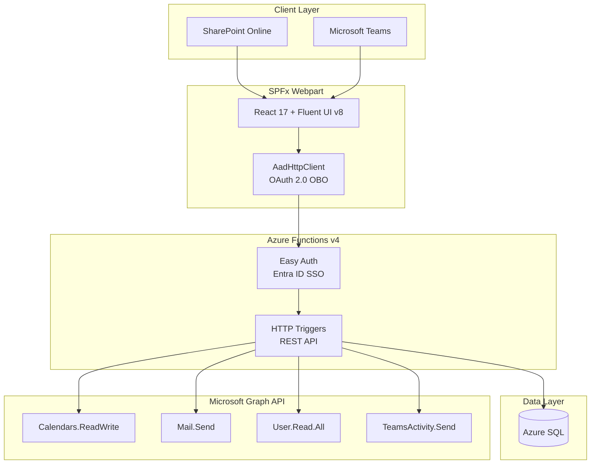

# RentAVehicle

**Internal Fleet Rental System for Microsoft 365**


---

## The Problem

Organizations with vehicle fleets spread across multiple locations rely on manual processes -- email chains, shared spreadsheets, or phone calls -- to coordinate which employee gets which car and when. This creates scheduling conflicts, idle vehicles, and unnecessary approval bottlenecks that slow teams down.

## The Solution

RentAVehicle is a self-service vehicle booking system built directly into Microsoft 365. Employees browse available vehicles at their office location, pick a date and time range, and confirm -- no approval chain, no back-and-forth. Managers have visibility into their team's bookings, and fleet admins get full control over vehicles, statuses, and reporting. The entire experience lives inside SharePoint and Microsoft Teams, using the M365 infrastructure employees already work in: Outlook calendars for vehicle schedules, email and Teams notifications for confirmations, and Entra ID for authentication and roles.

---

## Screenshots


*Vehicle availability and booking interface*


*Fleet management and reporting dashboard*

> [!NOTE]
> Screenshots to be captured from the live deployment.

---

## Key Features

- **Microsoft Graph API integration** -- Exchange resource calendars for vehicle schedules, personal calendar events for employees, email notifications, and Teams activity feed alerts
- **Multi-location fleet management** -- Locations synced from Entra ID (`officeLocation`), vehicles organized by site, timezone-aware booking display
- **Role-based access control** -- Employee, Manager, and Admin roles enforced via Entra ID app roles, with middleware authorization on every API call
- **Interactive booking experience** -- Navigable weekly availability strips per vehicle, unified date range picker with hourly precision, real-time conflict detection
- **Outlook calendar integration** -- Each vehicle has an Exchange resource mailbox; bookings appear on both the vehicle's calendar and the employee's personal calendar
- **Teams activity feed notifications** -- Booking confirmations and manager alerts delivered via Teams with deep links back into the app
- **Comprehensive admin reporting** -- Utilization rates, booking trends, most-used vehicles, per-location breakdowns, and CSV export
- **Cross-host rendering** -- Single SPFx webpart runs in both SharePoint Online pages and Microsoft Teams as a personal tab

---

## Architecture

The application follows a three-tier architecture with Microsoft Graph as the integration backbone. The SPFx webpart acquires an OAuth 2.0 on-behalf-of token via `AadHttpClient`, which the Azure Functions API validates through Entra ID Easy Auth. The API handles all business logic, persists data to Azure SQL, and calls Microsoft Graph with application-level permissions for calendar, email, and Teams operations.



---

## Tech Stack

| Layer | Technology |
|-------|------------|
| **Frontend** | SPFx 1.22, React 17.0.1, TypeScript 5.8, Fluent UI v8 |
| **Backend** | Azure Functions v4, Node.js 22, TypeScript 5.8 |
| **Data** | Azure SQL |
| **Auth** | Microsoft Entra ID, Easy Auth (SSO), AadHttpClient (OAuth 2.0 on-behalf-of) |
| **Integrations** | Microsoft Graph API -- Calendars, Mail, Users, Teams Activity |
| **Validation** | Zod (API request validation) |

---

## Project Scope

Built as a phased delivery across **10 development phases** (30 plans total), producing **17,175 lines of TypeScript/SCSS** across **254 files**. The project progressed from database schema and authentication (Phase 1) through calendar integration, notifications, and reporting (Phases 5-7), with dedicated UX refinement phases (8, 8.1, 8.1.1) driven by usability testing. A live tenant verification phase (Phase 9) confirmed all M365 integrations against a production Microsoft 365 environment.

---

## Getting Started

### Prerequisites

- Node.js 22 (LTS)
- npm
- Microsoft 365 developer tenant with SharePoint admin access
- Azure subscription (for Azure Functions and Azure SQL)
- [Azure Functions Core Tools](https://learn.microsoft.com/en-us/azure/azure-functions/functions-run-local) v4

### Installation

```bash
# Clone the repository
git clone https://github.com/<your-org>/Rentavehicle.git
cd Rentavehicle

# Install SPFx dependencies
cd spfx
npm install

# Install API dependencies
cd ../api
npm install
```

### Configuration

1. Create the Entra ID app registration following the [App Registration Guide](docs/app-registration.md)
2. Copy the environment template and fill in your tenant values:

```bash
cd api
cp local.settings.template.json local.settings.json
```

3. Set the required environment variables in `local.settings.json`:
   - `AZURE_TENANT_ID` -- your Microsoft 365 tenant ID
   - `AZURE_CLIENT_ID` -- the app registration client ID
   - `AZURE_CLIENT_SECRET` -- the app registration client secret
   - `AZURE_SQL_SERVER`, `AZURE_SQL_DATABASE` -- your Azure SQL connection details
   - `NOTIFICATION_SENDER_EMAIL` -- sender address for booking emails
   - `TEAMS_APP_ID` -- Teams app ID for activity notifications

### Local Development

```bash
# Start the API (builds TypeScript, then starts Azure Functions)
cd api
npm start

# In a separate terminal, start the SPFx webpart
cd spfx
npm run start
```

The SPFx workbench will open at `https://localhost:4321/temp/workbench.html`. For full functionality, use the hosted workbench on your SharePoint tenant.

> [!TIP]
> The API `prestart` script automatically syncs secrets from a shared config. See the [App Registration Guide](docs/app-registration.md) for details on the secrets file structure.

---

## Documentation

| Guide | Description |
|-------|-------------|
| [App Registration Guide](docs/app-registration.md) | Entra ID app setup, API permissions, Graph API configuration, and "Expose an API" scope |
| [Deployment Guide](docs/deployment.md) | SPFx package deployment to App Catalog, Teams tab setup, Azure Functions deployment |

---

## License

MIT

---

*Built with SPFx, React, Microsoft Graph, and Azure Functions.*
