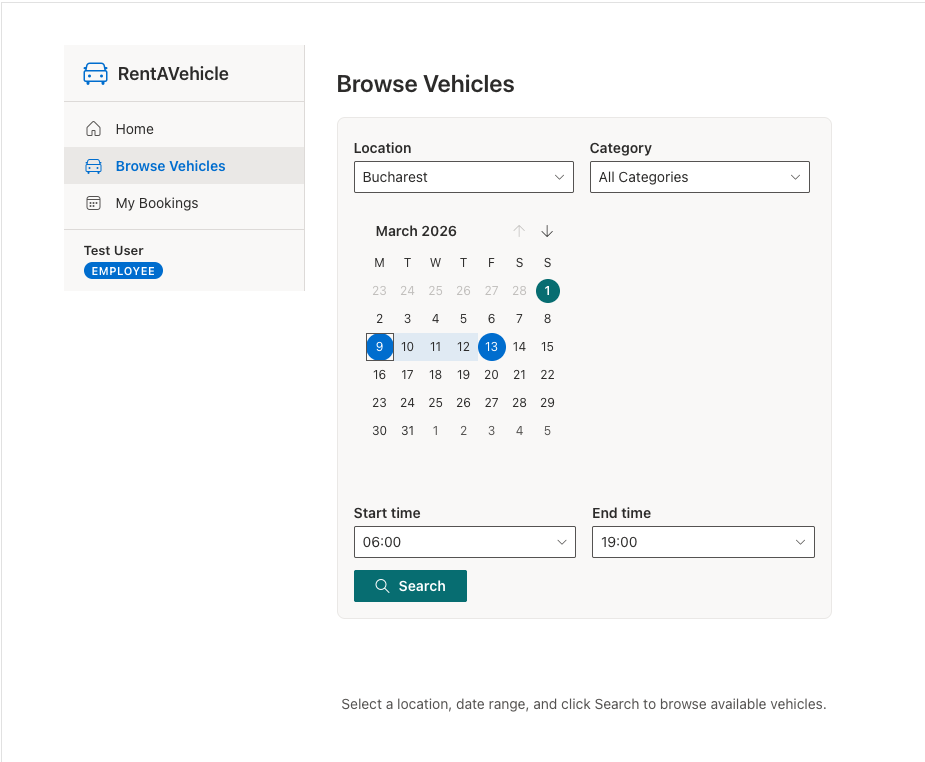
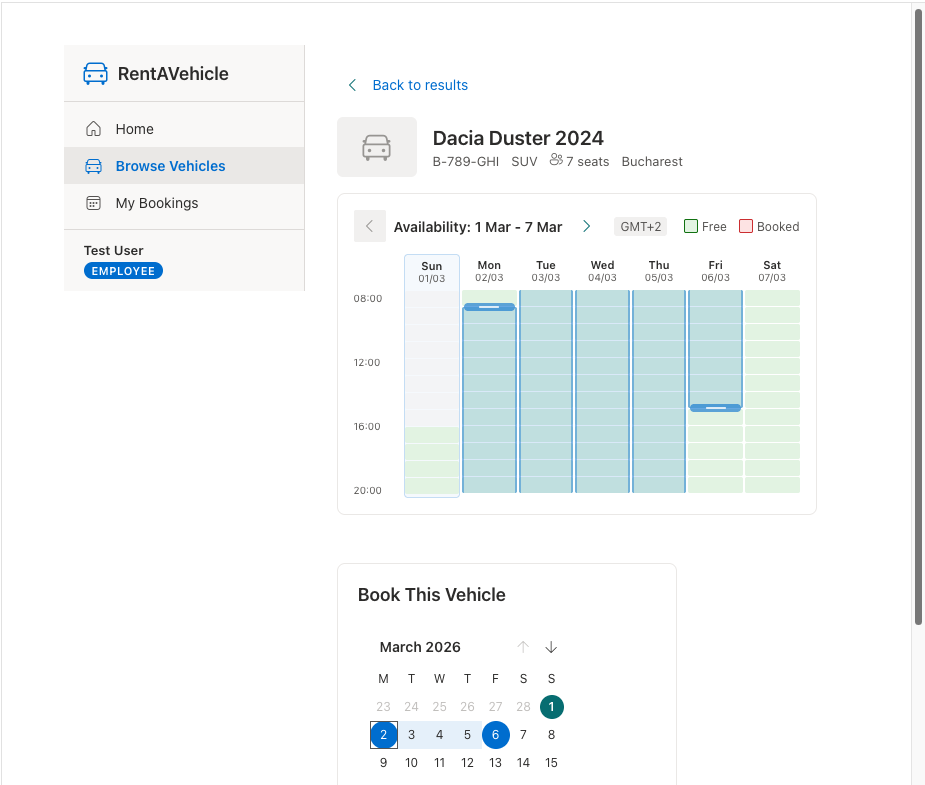
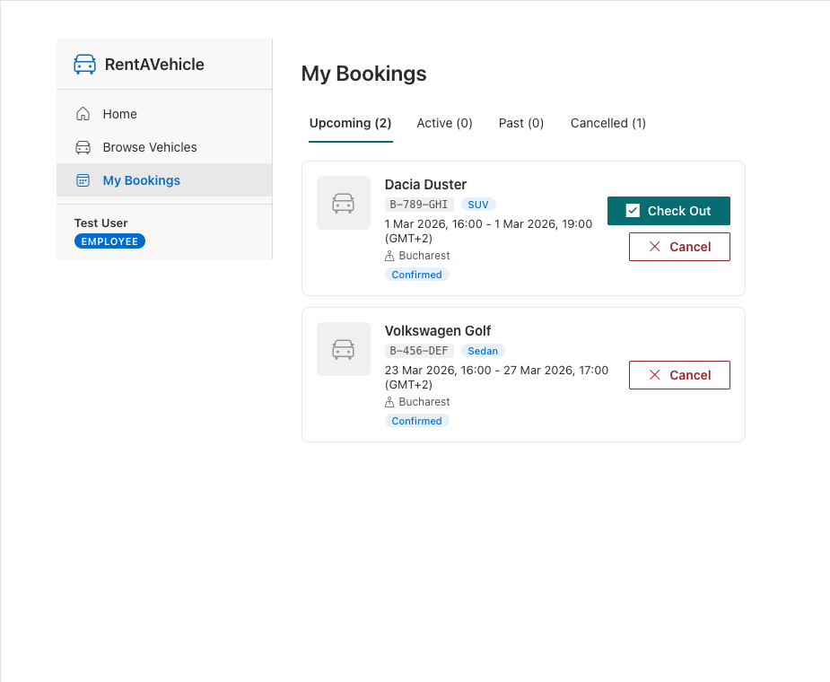
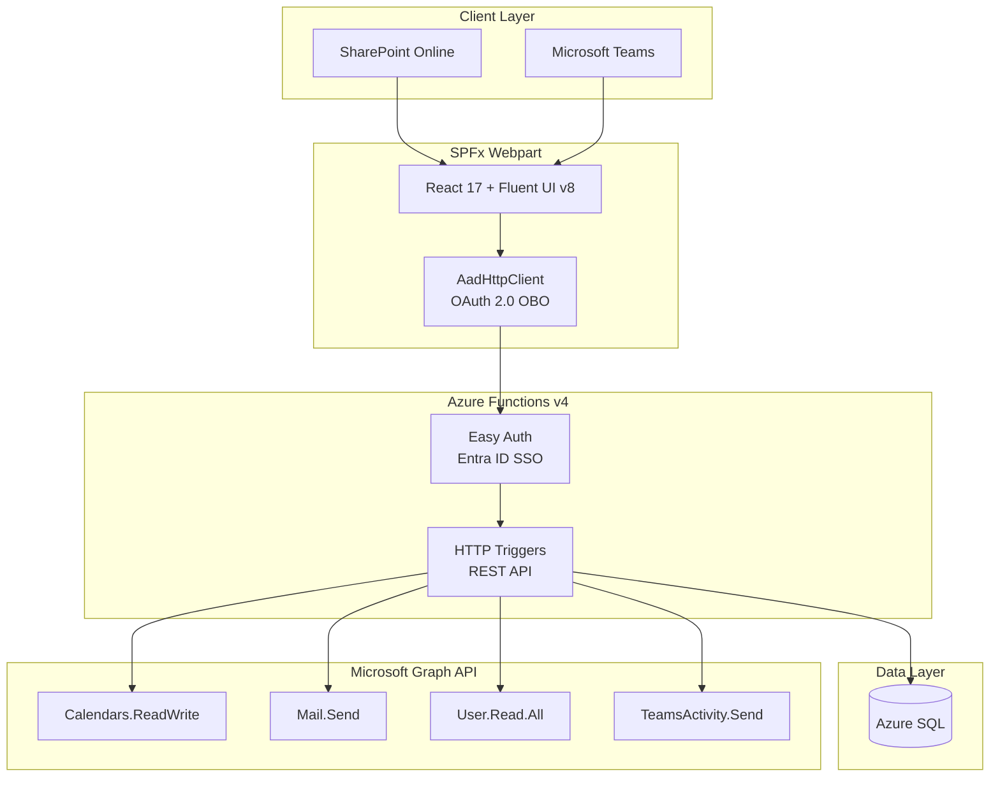

# RentAVehicle

**Internal Fleet Rental System for Microsoft 365**


---

## The Problem

Organizations with vehicle fleets spread across multiple locations rely on manual processes -- email chains, shared spreadsheets, or phone calls -- to coordinate which employee gets which car and when. This creates scheduling conflicts, idle vehicles, and unnecessary approval bottlenecks that slow teams down.

## The Solution

RentAVehicle is a self-service vehicle booking system built directly into Microsoft 365. Employees browse available vehicles at their office location, pick a date and time range, and confirm -- no approval chain, no back-and-forth. Managers have visibility into their team's bookings, and fleet admins get full control over vehicles, statuses, and reporting. The entire experience lives inside SharePoint and Microsoft Teams, using the M365 infrastructure employees already work in: Outlook calendars for vehicle schedules, email and Teams notifications for confirmations, and Entra ID for authentication and roles.

---

## Screenshots


*Browse available vehicles with location, date range, and time filters*


*View vehicle details, check weekly availability, and book directly*


*Track upcoming and past bookings with quick actions*

---

## Key Features

- **Microsoft Graph API integration** -- Exchange resource calendars for vehicle schedules, personal calendar events for employees, email notifications, and Teams activity feed alerts
- **Multi-location fleet management** -- Locations synced from Entra ID (`officeLocation`), vehicles organized by site, timezone-aware booking display
- **Role-based access control** -- Employee, Manager, and Admin roles enforced via Entra ID app roles, with middleware authorization on every API call
- **Interactive booking experience** -- Navigable weekly availability strips per vehicle, unified date range picker with hourly precision, real-time conflict detection
- **Outlook calendar integration** -- Each vehicle has an Exchange resource mailbox; bookings appear on both the vehicle's calendar and the employee's personal calendar
- **Teams activity feed notifications** -- Booking confirmations and manager alerts delivered via Teams with deep links back into the app
- **Comprehensive admin reporting** -- Utilization rates, booking trends, most-used vehicles, per-location breakdowns, and CSV export
- **Cross-host rendering** -- Single SPFx webpart runs in both SharePoint Online pages and Microsoft Teams as a personal tab

---

## Architecture

The application follows a three-tier architecture with Microsoft Graph as the integration backbone. The SPFx webpart acquires an OAuth 2.0 on-behalf-of token via `AadHttpClient`, which the Azure Functions API validates through Entra ID Easy Auth. The API handles all business logic, persists data to Azure SQL, and calls Microsoft Graph with application-level permissions for calendar, email, and Teams operations.



---

## Tech Stack

| Layer | Technology |
|-------|------------|
| **Frontend** | SPFx 1.22, React 17.0.1, TypeScript 5.8, Fluent UI v8 |
| **Backend** | Azure Functions v4, Node.js 22, TypeScript 5.8 |
| **Data** | Azure SQL |
| **Auth** | Microsoft Entra ID, Easy Auth (SSO), AadHttpClient (OAuth 2.0 on-behalf-of) |
| **Integrations** | Microsoft Graph API -- Calendars, Mail, Users, Teams Activity |
| **Validation** | Zod (API request validation) |

---

## Project Scope

Built as a phased delivery across **10 development phases** (30 plans total), producing **17,175 lines of TypeScript/SCSS** across **254 files**. The project progressed from database schema and authentication (Phase 1) through calendar integration, notifications, and reporting (Phases 5-7), with dedicated UX refinement phases (8, 8.1, 8.1.1) driven by usability testing. A live tenant verification phase (Phase 9) confirmed all M365 integrations against a production Microsoft 365 environment.

---

## Getting Started

This guide walks through local development setup. For production deployment, see [docs/deployment.md](docs/deployment.md).

### Prerequisites (macOS)

- [Homebrew](https://brew.sh/) (`/bin/bash -c "$(curl -fsSL https://raw.githubusercontent.com/Homebrew/install/HEAD/install.sh)"`)
- Node.js 22 (LTS) and npm (`brew install node@22`)
- Azure Functions Core Tools v4 (`brew tap azure/functions && brew install azure-functions-core-tools@4`)
- Microsoft 365 developer tenant with SharePoint admin access
- Entra ID app registration (follow [docs/app-registration.md](docs/app-registration.md) first)

### Prerequisites (Windows)

- Node.js 22 (LTS): `winget install OpenJS.NodeJS.LTS` or download from [https://nodejs.org](https://nodejs.org)
- Azure Functions Core Tools v4: `npm install -g azure-functions-core-tools@4 --unsafe-perm true` (alternatively: `winget install Microsoft.Azure.FunctionsCoreTools` or `choco install azure-functions-core-tools-4`)
- Microsoft 365 developer tenant with SharePoint admin access
- Entra ID app registration (follow [docs/app-registration.md](docs/app-registration.md) first)

### 1. Install Docker

**macOS** -- install Colima (lightweight, no Docker Desktop license required):

```bash
brew install colima docker
colima start
```

**Windows** -- install [Docker Desktop for Windows](https://docs.docker.com/desktop/install/windows-install/) with the WSL 2 backend enabled.

### 2. Start the local database

```bash
docker run -d --name rentavehicle-db -e "ACCEPT_EULA=1" -e "MSSQL_SA_PASSWORD=YourStrong!Pass123" -p 1433:1433 mcr.microsoft.com/azure-sql-edge
```

Azure SQL Edge runs the same SQL engine as Azure SQL but on ARM64/x64 Docker. The SA password matches `local.settings.template.json`.

### 3. Seed the database

```bash
cd api
npm install
node setup-db.js
```

Creates the `RentAVehicle` database, all tables (Locations, Categories, Vehicles, Bookings), and seeds test data (Bucharest + Cluj locations, Sedan + SUV categories, 3 test vehicles).

### 4. Configure your dev identity

Edit `dev.config.json` in the project root:

```json
{
  "role": "Admin",
  "name": "Your Name",
  "email": "you@yourtenant.onmicrosoft.com",
  "officeLocation": "Bucharest"
}
```

This sets your `LOCAL_DEV_*` values. The API uses these to simulate your identity during local development. Valid roles: `SuperAdmin`, `Admin`, `Manager`, `Employee`. The `officeLocation` must match a seeded location name.

### 5. Configure tenant secrets

Create `../.rentavehicle/secrets.json` (one directory above the project root -- keeps secrets outside the repo). On Windows you can also use backslashes: `..\.rentavehicle\secrets.json`.

```json
{
  "AZURE_TENANT_ID": "your-tenant-id",
  "AZURE_CLIENT_ID": "your-client-id",
  "AZURE_CLIENT_SECRET": "your-client-secret",
  "NOTIFICATION_SENDER_EMAIL": "noreply@yourtenant.onmicrosoft.com",
  "APP_BASE_URL": "https://yourtenant.sharepoint.com/sites/rentavehicle",
  "TEAMS_APP_ID": "your-teams-app-id",
  "SHAREPOINT_DOMAIN": "yourtenant.sharepoint.com"
}
```

> **How configuration syncs:** On every `npm start`, the `prestart` script runs `scripts/sync-dev-config.js` which merges three sources into `api/local.settings.json`:
>
> 1. `api/local.settings.template.json` -- committed base with safe defaults
> 2. `dev.config.json` -- your role, name, email, officeLocation
> 3. `../.rentavehicle/secrets.json` -- tenant secrets (IDs, keys, domain)
>
> The generated `local.settings.json` is gitignored and never committed. The `SHAREPOINT_DOMAIN` value also replaces the CORS placeholder so the hosted workbench can call the local API.

### 6. Start the API

```bash
cd api
npm start
```

Runs `sync-dev-config.js` (generates `local.settings.json`), builds TypeScript, then starts Azure Functions on `http://localhost:7071`.

### 7. Start the SPFx workbench

In a separate terminal:

```bash
cd spfx
npm install
npm run start
```

### 8. Open the workbench

Two options:
- **Local workbench**: `https://localhost:4321/temp/workbench.html` (limited -- no real M365 context)
- **Hosted workbench** (recommended): `https://yourtenant.sharepoint.com/_layouts/workbench.aspx` -- append `?debug=true&noredir=true&debugManifestsFile=https://localhost:4321/temp/manifests.js`

> [!NOTE]
> The hosted workbench requires the SPFx dev certificate to be trusted. Run `npx heft trust-dev-cert` in the `spfx` directory if you see certificate errors.

### Environment notes

- **Local dev** uses Azure SQL Edge on Docker (`localhost:1433`) with the `sa` account
- **Production** uses Azure SQL and Azure Functions -- see [docs/deployment.md](docs/deployment.md)
- The `contoso.sharepoint.com` in the template is a placeholder -- your real domain is injected via secrets
- To switch roles quickly: `node scripts/sync-dev-config.js --role Admin` (also accepts `Manager`, `Employee`, `SuperAdmin`)

---

## Documentation

| Guide | Description |
|-------|-------------|
| [App Registration Guide](docs/app-registration.md) | Entra ID app setup, API permissions, Graph API configuration, and "Expose an API" scope |
| [Deployment Guide](docs/deployment.md) | SPFx package deployment to App Catalog, Teams tab setup, Azure Functions deployment |

---

## License

MIT

---

*Built with SPFx, React, Microsoft Graph, and Azure Functions.*
